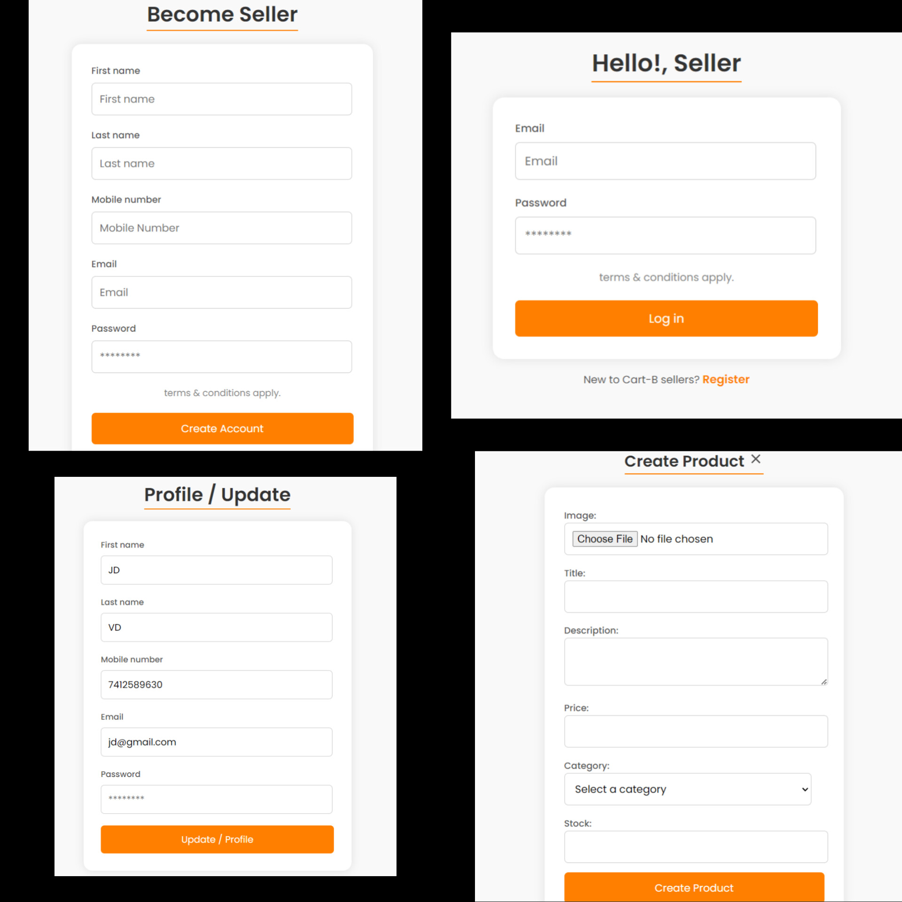
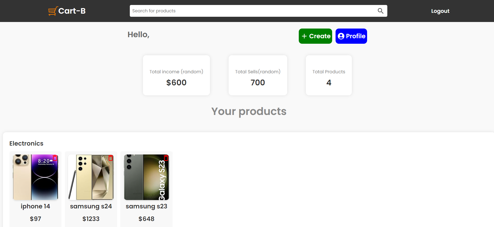
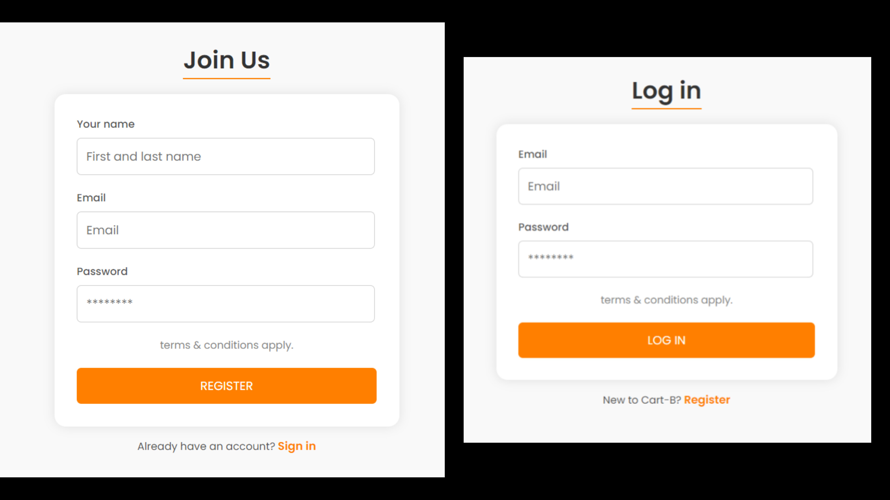
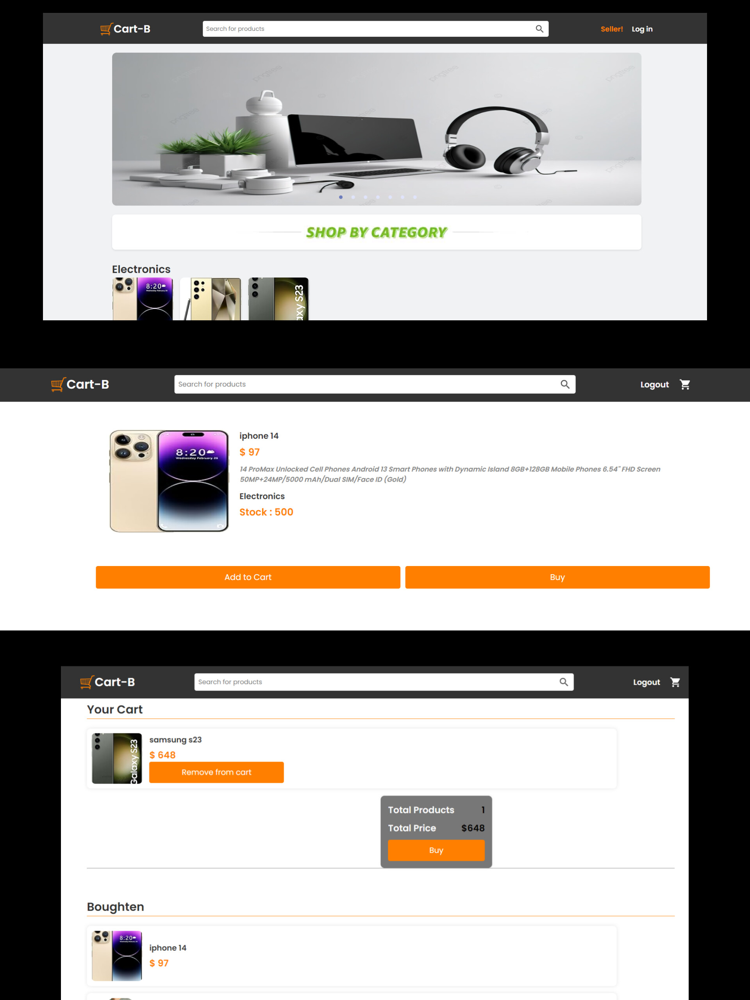

# Cart-B

## Description

Full Stack E-commerce Web App built with MERN STACK

## Demo

[https://cart-b.onrender.com](https://cart-b.onrender.com)

## ScreenShots

### Admin Authentication



### Admin Dashboard



### User Authentication



### Home / Product / Cart Page



## Tech Stack

**Client:** React JS

**Server:** Node JS, Express JS

**Database:** Mongo DB

**Image Uploading:** Cloudinary

## Features

- **Admin**

- **Create Product**

- **View All Admin Product**

- **Admin Dashboard**

- **Update Product**

- **Delete Product**

- **Products With Category**

- **Normal User Authentication**

- **Product Page**

- **Add to Cart**

- **Add to Buy list (no real payment gateway)**

- **Admin Logout**

- **Normal User Logout**

## Installation

To run this project locally, follow these steps:

1. Clone the repository:

```bash
  git clone https://github.com/Yuvrajshankar/Cart-B.git
```

2. Go to the project directory

```bash
  cd Cart-B
```

3. Install dependencies

```bash
  npm install
```

```bash
  cd frontend/
  npm install
```

5. add **".env"** in root folder

```bash
ADMIN_JWT_SECRET = "admin jwt secret"
JWT_SECRET = "your secret"
MONGO_URI = "Your MongoUrl"
NODE_ENV = development
PORT = 3030

```

4. Start the server

```bash
  npm run server
```

5. Start the Client

```bash
  cd frontend
  npm start
```

## Made By

- [@Yuvrajshankar](https://github.com/Yuvrajshankar)

## License

This project is licensed under the [GNU License](LICENSE).
